# Farrlind Known World Map - Canon Draft

This is a schematic map built from reviewed canon through session20. Distances and compass placement are approximate unless stated in the travel log.

```mermaid
flowchart LR
  Bentrios["Bentrios<br/>city, campaign start"]
  FeyWoods["Fey Woods<br/>Oak, witch, fey visions"]
  Thataways["Thataways<br/>Fey village, Well Khorag"]
  SporeSanctuary["Spore Sanctuary<br/>Zakana, healing mushrooms"]
  Bellemaine["Bellemaine<br/>elven city, library, Dao attack"]
  RoadDig["Road to Archaeological Dig Site<br/>caravan road, Sam battle"]
  DigSite["Archaeological Dig Site<br/>ancient abyssal history"]
  MountainRoad["Mountain Road<br/>storm cave, Cole"]
  DruidRetreat["Druid Retreat<br/>Jennifer / coven"]
  Paramon["Paramon<br/>coastal city, Well, Namaloa temple"]
  Crossroads["Crossroads<br/>festival"]
  Balrog["Balrog<br/>dwarven city, Orsydon"]
  CoastCatur["Coast near Catur<br/>6 miles from Catur"]
  Catur["Catur<br/>sunken city, not yet entered"]

  Bentrios -->|"S02: foot, 1d, high"| FeyWoods
  FeyWoods -->|"S04: foot, 0d, high"| Thataways
  Thataways -->|"S05: foot, 1d, high"| Bentrios
  Bentrios -->|"S06: foot, 1d, high"| Thataways
  Thataways -.->|"S08: foot, 0d, medium"| SporeSanctuary
  SporeSanctuary -.->|"S08: foot, 0d, medium"| Bellemaine
  Bellemaine -->|"S10: wagon, 0d, high"| RoadDig
  RoadDig -.->|"S12: wagon, 12d, medium"| DigSite
  DigSite -.->|"S13: foot, 0d, medium"| MountainRoad
  MountainRoad -->|"S13: foot, 4d, high"| DruidRetreat
  DruidRetreat -->|"S14: portal, 0d, high"| Paramon
  Paramon -->|"S17: foot, 2d, high"| Crossroads
  Crossroads -->|"S17: foot, 3d, high"| Balrog
  Balrog -->|"S20: foot, 4d, high"| CoastCatur
  CoastCatur -. "known nearby: 6 miles" .-> Catur

  classDef city fill:#f7f2df,stroke:#7b633d,stroke-width:1px,color:#2a2418;
  classDef wild fill:#e4f0df,stroke:#4d7c59,stroke-width:1px,color:#1f3525;
  classDef road fill:#eef1f4,stroke:#687382,stroke-width:1px,color:#20252b;
  classDef danger fill:#f3e1df,stroke:#9a4d48,stroke-width:1px,color:#3b1f1d;
  class Bentrios,Bellemaine,Paramon,Balrog city;
  class FeyWoods,Thataways,SporeSanctuary,DruidRetreat wild;
  class RoadDig,MountainRoad,Crossroads,CoastCatur road;
  class DigSite,Catur danger;
```

## Route Notes

- session02: Bentrios -> Fey Woods by foot (1 day, high confidence). Party set out from Bentrios toward the Fey Woods in search of Urgan's Axe; they do not reach Thataways in this session.
- session04: Fey Woods -> Thataways by foot (0 days, high confidence). After the fey witch battle, the party follows the lake and burned-out tree landmarks, meets a centaur, and is led to the village of Thataways.
- session05: Thataways -> Bentrios by foot (1 day, high confidence). Party left the Fey forest/Thataways area and traveled back to Bentrios.
- session06: Bentrios -> Thataways by foot (1 day, high confidence). Party returned from Bentrios to Thataways/Fey forest to return Urgan's Axe.
- session08: Thataways -> Spore Sanctuary by foot (0 days, medium confidence). Party travels from Thataways into the southern forest/spore sanctuary area.
- session08: Spore Sanctuary -> Bellemaine by foot (0 days, medium confidence). Party leaves the spore sanctuary and reaches Bellemaine.
- session10: Bellemaine -> Road to Archaeological Dig Site by wagon (0 days, high confidence). Party joins the caravan and departs Bellemaine toward the northern archaeological dig site.
- session12: Road to Archaeological Dig Site -> Archaeological Dig Site by wagon (12 days, medium confidence). After the Sam battle and no further incident, the caravan reaches the archaeological dig site.
- session13: Archaeological Dig Site -> Mountain Road by foot (0 days, medium confidence). Party leaves the archaeological dig site and begins the mountain route toward Jennifer's retreat.
- session13: Mountain Road -> Druid Retreat by foot (4 days, high confidence). Party travels through the mountains toward the Druid Retreat and is led there by Jennifer.
- session14: Druid Retreat -> Paramon by portal (0 days, high confidence). After the party's encounter at the Druid Retreat, they used a portal to travel to Paramon.
- session17: Paramon -> Crossroads by foot (2 days, high confidence). After obtaining water-breathing supplies, the party sets out from Paramon and reaches the Crossroads Festival.
- session17: Crossroads -> Balrog by foot (3 days, high confidence). After the Crossroads Festival stop, the party continues to Balrog and enters the dwarven city.
- session20: Balrog -> Coast near Catur by foot (4 days, high confidence). Party departed Balrog and traveled four days to the coast near Catur; the session ends at the shoreline, not in Catur itself.

## Known But Not Yet Placed

- Henedal: across the sea and known as the birthplace of magic.
- Monastery of the Open Hand: in the Gale.
- Celestial Isles: devastated outer rim; discussed in lore, not yet visited.
- Gale: broader regional reference connected to storms, Wells, and the Monastery of the Open Hand.

## Map Assumptions

- This is a route topology, not a true geographic projection.
- Directionality mostly follows the party's travel order.
- Medium-confidence routes are drawn with dotted lines.
- Catur is shown as nearby but distinct because session20 canon ends at the coast near Catur, roughly six miles away.
