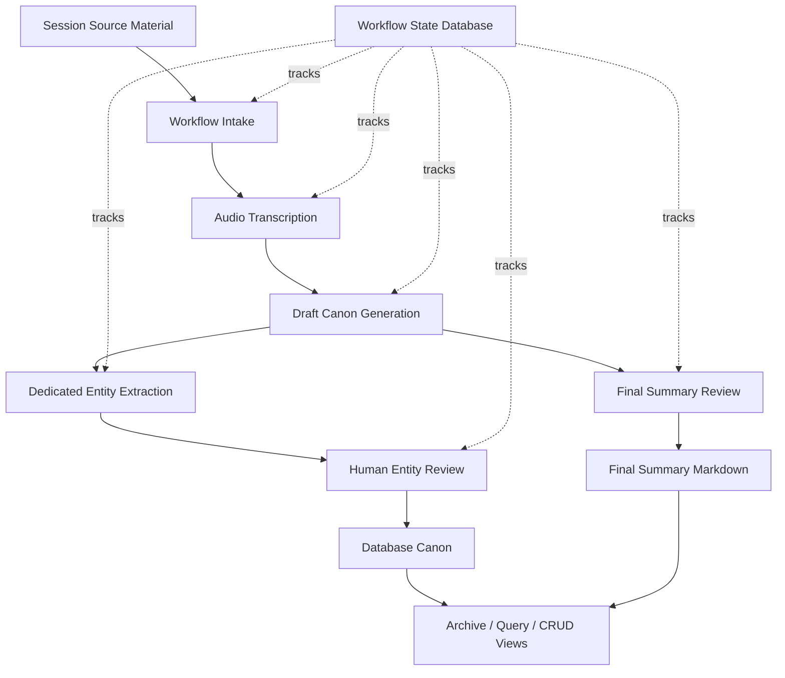

# Campaign Session Workflow Architecture

This document describes the high-level architecture for moving a tabletop campaign session from raw source material into reviewed, queryable campaign canon.

The central rule is:

```text
AI drafts the memory. The human canonizes it.
```

Transcripts, model outputs, extracted entities, event fragments, and draft summaries are all source material until a human reviews and applies them. Once accepted entity reviews are applied to the database, they become the golden structured truth for NPCs, locations, artifacts, lore items, combat encounters, and open threads. The final session summary is a separate narrative canon document.

## System Shape



## Major Components

### Campaign Files

Each campaign owns its own file tree under:

```text
campaigns/{campaign}/
```

Important session artifacts include:

```text
audio/sessionXX.*
raw/sessionXX_transcript.txt
clean/sessionXX_curated.md
clean/sessionXX_narrative.md
clean/sessionXX_spine.yaml
extracted/sessionXX_*.json
extracted/sessionXX_*_reviewed.json
final/sessionXX_summary.md
```

The file tree preserves draft artifacts, reviewed decisions, and final Markdown outputs. These files are intentionally inspectable so the user can see what the system produced at every stage.

### Workflow Definition

The ordered workflow is defined in:

```text
workflows/session_workflow.yaml
```

The YAML file defines each step, its lane, expected inputs, expected outputs, dependencies, gate type, rerun policy, and canon impact.

The workflow state itself lives in the database, not in YAML. The YAML is the definition; the database is the runtime record.

### Workflow Worker

The Docker `workflow_worker` service watches the workflow queue and runs automated intake jobs.

Its job is to move a new session through the safe automated stages:

```text
register source
  -> transcribe
  -> status check
  -> curate draft canon packet
  -> generate narrative draft
  -> extract session spine
  -> validate session spine
  -> run entity extractors
  -> generate draft event/supporting artifacts
```

The worker should stop before human review gates. It can create drafts, but it cannot canonize them.

### Web Application

The web app is the operator surface. It has two modes:

```text
edit mode    - local working app with CRUD and review tools
archive mode - read-only campaign viewer
```

Edit mode is where the user reviews extracted entities, edits canon records, runs utilities, and monitors workflow status.

Archive mode hides mutating controls and presents the campaign as a read-only archive.

### Database Canon

The database stores structured campaign truth:

```text
sessions
locations
npcs
artifacts
lore items
combat encounters
open threads
timeline/travel data
workflow status
lookup tables
```

Once entity review decisions are applied, the database is authoritative for those structured entities. Later summary work must not reload old draft YAML or stale extraction files in a way that overwrites accepted entity canon.

## End-To-End Workflow

### 1. Session Initiation

The user initiates a new session from the edit app, providing:

- campaign
- session number
- real-world session date
- audio file path or uploaded audio file

The app creates or updates the session record, registers the source audio, initializes workflow state from `workflows/session_workflow.yaml`, and queues the automated intake job.

### 2. Transcription

The transcription stage converts audio into a raw transcript.

The current production path uses faster-whisper with two parallel workers. It writes:

```text
campaigns/{campaign}/raw/sessionXX_transcript.txt
```

This transcript is source material, not canon.

### 3. Draft Canon Generation

The system uses the configured local model, currently `gemma4:e2b`, to turn the transcript into a draft canon packet and narrative draft.

The draft packet is meant to mine the transcript for useful campaign memory:

- narrative summary
- major events
- NPCs and entities
- locations
- artifacts and items
- lore items
- combat encounters
- open threads
- timeline notes
- inventory and resource notes

This stage is designed to reduce human workload by producing a coherent review packet before database canon is touched.

### 4. Dedicated Entity Extraction

After the draft canon packet and session spine exist, dedicated extractors run separately.

Current extractor families:

- NPC extractor
- location extractor
- artifact extractor
- lore item extractor
- combat encounter extractor
- open thread extractor

Each extractor focuses on one kind of information and writes a draft JSON file under:

```text
campaigns/{campaign}/extracted/
```

Extractor output is a queue for human review. It is not canon by itself.

### 5. Human Entity Review

The user reviews each entity section in the edit app.

For each extracted candidate, the user can accept, reject, edit, merge, or add missing records. When the review is applied, the system writes a reviewed decision artifact and updates the database.

After this point, the database record is the golden structured truth for that entity type.

This is the most important safety boundary in the workflow:

```text
draft extraction JSON -> human review -> applied database canon
```

No later automated step should undo this boundary.

### 6. Final Summary Review

After the structured entities are reviewed, the user creates or edits the final session summary.

The final summary is a human-approved narrative document stored at:

```text
campaigns/{campaign}/final/sessionXX_summary.md
```

The summary should reflect the accepted canon and can use the draft packet, transcript, and extracted events as supporting material. Its purpose is narrative memory and human readability, not bulk database mutation.

### 7. Session Completion

The session is complete when:

- source material is registered
- transcription is done or a diary/source fallback exists
- draft canon artifacts exist
- entity reviews are applied or intentionally skipped
- final summary is reviewed and written
- workflow status reflects completion
- health checks pass

At that point, the session is safe to query, browse, export, and publish to archive mode.

## Canon Safety Model

The workflow separates draft material from canon material.

Draft/source artifacts:

- raw transcript
- curated packet
- narrative draft
- session spine
- event fragments
- extractor JSON
- validation reports

Canon/reviewed artifacts:

- reviewed extraction decision files
- database entity rows after human apply
- final summary Markdown
- manually maintained registry records

The rule for reruns:

```text
Reruns may regenerate draft artifacts.
Reruns may not overwrite reviewed canon without explicit human review.
```

## Status Model

Workflow status should describe the major operator-facing state, not every internal file detail.

The useful high-level status chain is:

```text
session initiated
  -> audio validated
  -> transcription running / complete
  -> draft generation complete
  -> entity extraction complete
  -> entity review needed / complete
  -> final summary review needed / complete
  -> session ingest complete
```

For long-running transcription, status should ideally include:

- current chunk number
- total chunk count
- start time
- elapsed time
- completed time
- summary comment

## Archive Publishing

The edit app is the source of truth. The archive app and static exports are publishing targets.

Archive mode should read from accepted database canon and final Markdown outputs. It should not expose review queues, workflow internals, edit buttons, validation queues, or mutation endpoints.

The static archive export is a later publication step:

```text
database canon + final markdown + media assets
  -> static archive dist
  -> static repository / hosting target
```

## Design Principle

The system should make the human do the work only where judgment matters.

AI and automation should handle:

- transcription
- first-pass extraction
- rough organization
- candidate discovery
- draft summaries
- status tracking

The human should handle:

- canon decisions
- corrections
- merges
- ambiguity resolution
- final narrative judgment
- publishing approval
